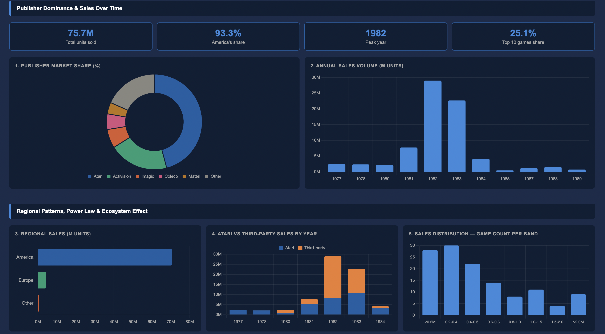

# Atari 2600 — Game Sales Analysis Dashboard

> An end-to-end data visualisation project analysing household game software adoption on the Atari 2600 — one of the earliest mass-market home gaming platforms.

**Tools:** JavaScript · HTML · CSS · Chart.js · Python (pandas)
**Dataset:** VGChartz video games dataset · 500 Atari 2600 titles · 1977–1990

## Live demo

🔗 [View the dashboard](https://aryanmehan05-bot.github.io/atari-2600-sales-analysis/atari2600_sales_dashboard.html)

## Overview

The dashboard explores publisher dominance, regional concentration, sales distribution, and the dramatic 1982 peak that defined the platform's history.

## Approach

The raw dataset contained 500 titles, of which 126 had usable sales figures across America, Europe, Japan, and Other regions. Data cleaning and feature engineering were performed in Python using pandas — extracting release years, computing publisher market share, segmenting titles by sales bands, and separating first-party (Atari) from third-party publisher sales for year-over-year comparison.

The dashboard itself was built from scratch in vanilla JavaScript and HTML using Chart.js for rendering. Styling was handled with CSS custom properties so the colour palette could be controlled from a single source, and chart configurations were structured around shared base options to keep the code maintainable across ten different visualisations.

## Visualisations

The final dashboard contains ten charts organised into three thematic sections:

- **Publisher dominance and timeline** — donut chart of market share, bar chart of annual sales volume, and four KPI cards
- **Regional patterns, power law and ecosystem effect** — horizontal regional bar, stacked first-party vs third-party comparison, sales distribution histogram, top 15 titles ranking, and a Pareto concentration curve
- **Geographic lock-in, catalogue efficiency and peak year breakdown** — America's share per publisher, titles released vs total sales scatter plot, and a pie chart of the 1982 publisher mix

## Key findings

- The top 25 games captured **46%** of all sales across 126 tracked titles, confirming a textbook power-law distribution
- Activision held **20%** of platform market share with just 47 titles, while Atari needed 128 titles to hold 46% — catalogue quality outperformed catalogue volume
- In the peak year 1982, third-party publishers collectively outsold Atari itself at **20.7M vs 8.3M units**, demonstrating that the ecosystem of complementary content producers drove the platform's biggest year rather than the platform owner alone
- Sales collapsed from **29M units in 1982 to under 5M by 1984**, illustrating how fragile a household adoption tipping point can be once quality deteriorates and the market becomes saturated
- **93.3%** of all platform sales came from America, with Europe contributing only 5.6% — confirming that early-stage household technology adoption tends to anchor in a single cultural market before spreading

## Reflection

This project was an opportunity to put theory from FIT3179 Data Visualisation into practice through a complete build cycle — from raw spreadsheet to interactive dashboard. The biggest learning came from chart selection: choosing the right visual for each pattern (power-law vs distribution vs concentration vs comparison) made the difference between a dashboard that looked busy and one that actually told a story.
